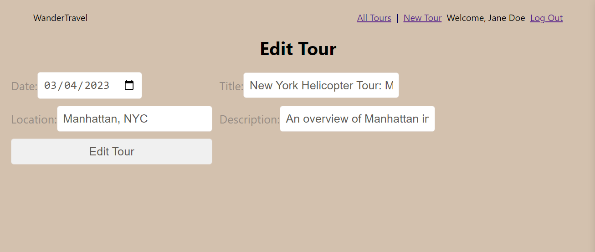

# WanderTravel
 Title: WanderTravel

# Background of the App
I love traveling and creating memories such as recording and writing reviews about the place. I want to record all places I have been to and be able to look back at my memories. I created an app to record the tours and adventures that I encountered when I go on vacation. 

# Screenshots 

# Languages and Tool Used:
* Javascript 
* HTML
* CSS
* NodeJS
* Express
* MongoDB, Mongoose
* React
* React Rating Stars Component (https://www.npmjs.com/package/react-rating-stars-component?activeTab=readme)

# Getting Started: 
To access the app: [WanderTravel](https://github.com/JennyYHFang/wandertravel)

# Next Steps: 
In the future I plan to...
* Add in update and delete function for the reviews
* Make a function where you can upload images
* Users are able to connect with each other

# Key Learning and Takeaways
* React is interesting and is easily broken if not cautious
* React needs to be very specific and write what we want to see on each page
* The function I like most is the Tour page because I can write my reviews and give star ratings.
